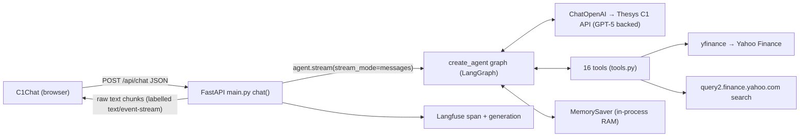
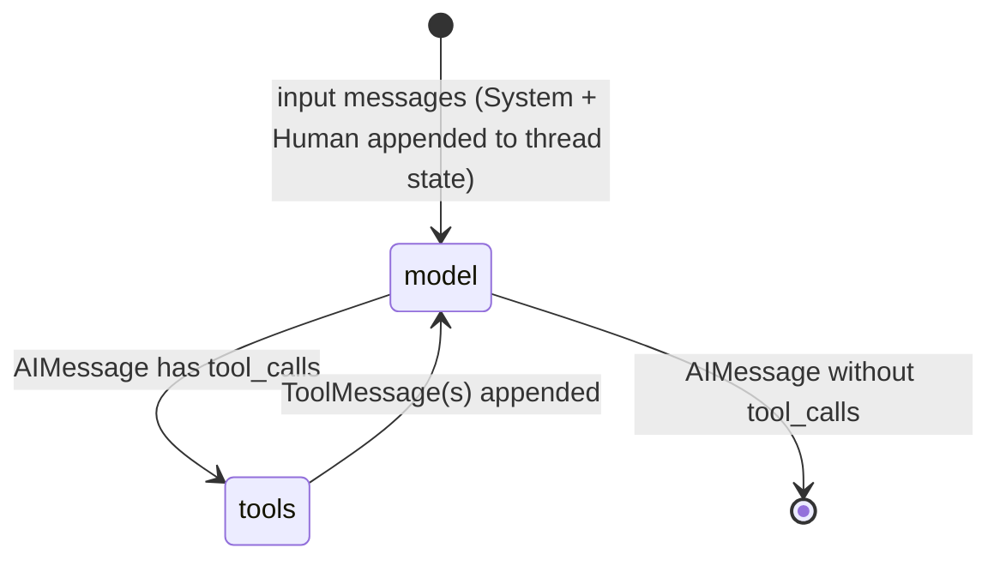
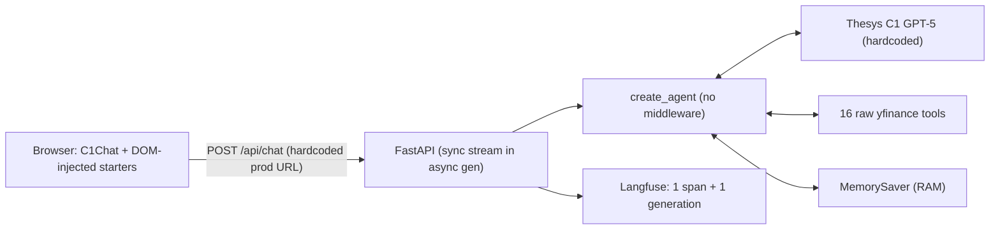
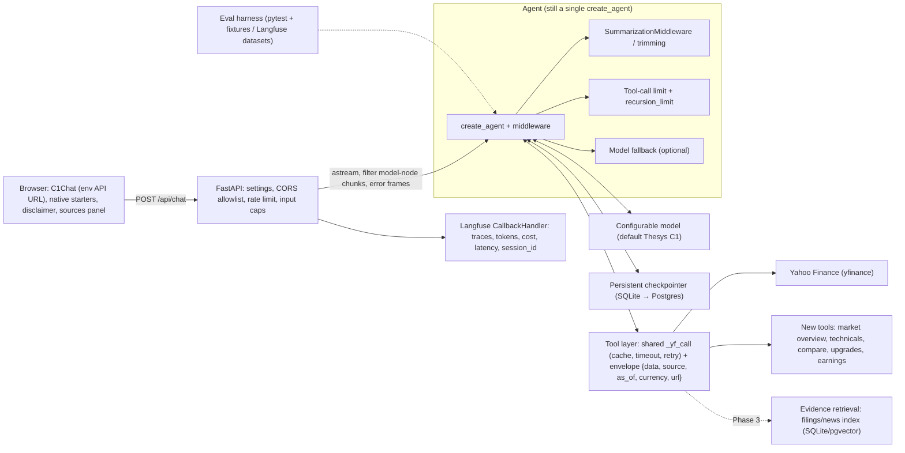

# PROJECT_AUDIT.md — Initial Repository Audit

> **Scope:** Static audit of the repository as of baseline commit `c19ce9e` ("chore: establish project baseline", 2026‑10‑07).
> **No application files were modified.** This document is the only file created.
>
> **Method:** I read every tracked source, config and doc file line by line (`main.py`, `MarketInsight/**`, `config/**`, `frontend/**`, manifests, `render.yaml`, `vercel.json`, `README.md`, `LICENSE`, plus key entries in `uv.lock`). I did **not** install dependencies or run the app, so runtime behaviour is inferred from the code and from the pinned library versions in `uv.lock`. Findings that need a local run to confirm are marked **(verify at runtime)**.
>
> **Legend:** **EXISTING** = present in the code today. **PROPOSED** = does not exist yet.

---

# 1. Product Overview

**Current product name:** "Market Insight" (used in `README.md`, `frontend/index.html`, `frontend/src/App.tsx`, `package.json`, `pyproject.toml`, `render.yaml`, and the Python package directory `MarketInsight/`).

**What it actually does (EXISTING):**

- It's a single-page chat app. The user types a question about stocks or markets.
- The React frontend uses the third-party **Thesys C1 Generative UI SDK** (`C1Chat`). It POSTs the message to the backend at `/api/chat`.
- The FastAPI backend passes the message to a **LangChain v1 `create_agent`** ReAct agent, which runs on LangGraph. The agent can call **16 tools**: 15 wrap `yfinance`, and 1 calls Yahoo's public search endpoint to resolve tickers.
- The LLM is **not called directly from OpenAI**. It's `c1/openai/gpt-5/v-20250930`, called through the **Thesys C1 embed API** (`https://api.thesys.dev/v1/embed/`) with the OpenAI-compatible `ChatOpenAI` client. C1 returns a **Generative UI markup stream**, which `C1Chat` renders as rich components (cards, tables, charts).
- Tokens stream back to the browser.
- Conversation memory is kept per `threadId` by LangGraph's **in-process `MemorySaver`**. It's lost on every restart or redeploy.
- Each request is wrapped in a Langfuse span plus a generation (coarse tracing).

**Current product capabilities (EXISTING):**

| Capability | Status | Notes |
|---|---|---|
| Natural-language Q&A about individual stocks | ✅ | Through the agent and tools |
| Current price | ✅ | `stock.info['regularMarketPrice']` returns a bare number with no currency or timestamp |
| Historical OHLCV | ✅ | Unbounded date range; returns raw dict |
| Financial statements (BS / IS / CF) | ✅ | Annual only (`balance_sheet`, `financials`, `cashflow`) |
| Company profile and ratios | ✅ | Raw `stock.info` dump (~100+ fields) |
| Dividends, splits | ✅ | |
| Holders (institutional, major, mutual fund), insider transactions | ✅ | |
| Analyst recommendations | ✅ | Two tools that are likely redundant (see §7) |
| Company name → ticker resolution | ✅ | Takes the first Yahoo search hit |
| Stock news | ✅ | Raw yfinance news list |
| Multi-turn memory within a thread | ✅ (fragile) | In-memory only, unbounded, no trimming |
| Rich generative UI (charts/tables) | ✅ | Comes from the Thesys C1 model and SDK, not from project code |
| Suggested prompts on empty chat | ✅ | Four India-market prompts injected by DOM manipulation |
| Market-wide / index overview tool | ❌ | No dedicated tool. The LLM could call `get_stock_price("^NSEI")`, but nothing prompts it to |
| Technical indicators, screening, comparison | ❌ | |
| Citations / source attribution | ❌ | |
| RAG over filings or documents | ❌ | |
| Persistent history, auth, rate limiting | ❌ | |
| Tests, evals, CI | ❌ | |

---

# 2. Repository Structure

```
AI-Financial-Research-Copilot/
├── .gitignore                 # Combined Python + Node template (ignores .env, logs/, node_modules, lockfiles for npm/yarn/pnpm)
├── .python-version            # "3.13"
├── LICENSE                    # GNU GPL v3 (canonical, unmodified text)
├── README.md                  # Project README ("Market Insight") – box-drawing chars are mojibake
├── main.py                    # FastAPI app: /health, /api/chat (streaming), Langfuse, CORS
├── package.json               # Root convenience scripts (concurrently backend+frontend)
├── pyproject.toml             # uv project "market-insight", requires-python >=3.13
├── requirements.txt           # Unpinned pip deps (used by Render)
├── uv.lock                    # Full lock (fastapi 0.124.4, langchain 1.1.3, langgraph 1.0.5, …)
├── render.yaml                # Render web service for backend (PYTHON_VERSION 3.11.0)
├── config/
│   ├── __init__.py            # empty
│   └── config.py              # Pydantic request models only (PromptObject, RequestObject)
├── MarketInsight/
│   ├── __init__.py            # empty
│   ├── components/
│   │   ├── __init__.py        # empty
│   │   └── agent.py           # ChatOpenAI → Thesys C1; create_agent(16 tools, MemorySaver)
│   └── utils/
│       ├── __init__.py        # empty
│       ├── logger.py          # Root logger: file (DEBUG) + console (WARNING)
│       └── tools.py           # 16 @tool functions (yfinance + Yahoo search)
└── frontend/                  # Vite + React 19 + TypeScript
    ├── .env.production        # VITE_API_URL=https://marketinsight-skgl.onrender.com/api/chat (UNUSED by code)
    ├── .gitignore
    ├── eslint.config.js
    ├── index.html             # Title/meta "Market Insight"
    ├── package.json           # @thesysai/genui-sdk, @crayonai/react-ui, react 19
    ├── public/icon.png        # Logo (purple circle, candlestick + arrow) – project branding
    ├── src/
    │   ├── App.css            # Styles for injected recommendation cards
    │   ├── App.tsx            # C1Chat + DOM-injected recommendations
    │   ├── assets/react.svg   # Vite template leftover (UNUSED)
    │   └── main.tsx           # React root
    ├── tsconfig*.json
    ├── vercel.json            # Vercel build config
    └── vite.config.ts         # Dev server port 3000; /api proxy → localhost:8000 (effectively unused)
```

**Size:** about 600 lines of first-party code. `tools.py` is 433 lines, and most of that is duplication.

**Not present:** tests, CI workflows, Dockerfile, docker-compose, `.env.example`, screenshots, docs folder, migrations, database.

---

# 3. Backend Architecture

**Stack (EXISTING):** FastAPI 0.124 · Uvicorn · LangChain 1.1.3 (`langchain.agents.create_agent`) · LangGraph 1.0.5 (`MemorySaver`) · `langchain-openai` 1.1.3 · yfinance 0.2.66 · requests · Langfuse 3.10.6 · python-dotenv.



**Module responsibilities:**

| File | What it actually does |
|---|---|
| [main.py](file:///d:/Projects/AI-Financial-Research-Copilot/main.py) | Creates `FastAPI()`, adds permissive CORS, builds a global `Langfuse` client from env vars, and defines `GET /health` and `POST /api/chat`. The chat handler builds `config={'configurable': {'thread_id': threadId}}`, then iterates **synchronously** over `agent.stream(...)` inside an `async def generate()`, yields `token.content`, and wraps the whole thing in Langfuse observations. `__main__` runs uvicorn on `0.0.0.0:8000`. |
| [agent.py](file:///d:/Projects/AI-Financial-Research-Copilot/MarketInsight/components/agent.py) | Runs `load_dotenv()`, builds a module-level `ChatOpenAI(model="c1/openai/gpt-5/v-20250930", base_url="https://api.thesys.dev/v1/embed/")`, and builds a module-level `agent = create_agent(model, tools=[…16…], checkpointer=MemorySaver())`. Uses wildcard import `from MarketInsight.utils.tools import *`. |
| [tools.py](file:///d:/Projects/AI-Financial-Research-Copilot/MarketInsight/utils/tools.py) | 16 `@tool`-decorated sync functions. See §7. |
| [logger.py](file:///d:/Projects/AI-Financial-Research-Copilot/MarketInsight/utils/logger.py) | At import time it creates `logs/<date>/<timestamp>.log`. On the first `get_logger` call it attaches a DEBUG file handler and a WARNING console handler to the **root** logger. |
| [config.py](file:///d:/Projects/AI-Financial-Research-Copilot/config/config.py) | It isn't really configuration. It only holds Pydantic request schemas: `PromptObject{content,id,role}` and `RequestObject{prompt,threadId,responseId}`. |

**Behaviours worth noting:**

1. **Sync stream inside an async generator.** `agent.stream()` is a blocking iterator. It's consumed directly inside `async def generate()`, so every LLM token wait and every yfinance HTTP call **blocks the event loop**. While one chat runs, other requests (including `/health`) stall. That limits throughput to roughly one active chat per worker.
2. **The system prompt is re-sent every turn.** Each request passes `[SystemMessage, HumanMessage]` as input. With a checkpointer and LangGraph's `add_messages` reducer, these are **appended** to the stored thread, so a thread with N turns holds N copies of the system prompt. `create_agent` has a `system_prompt=` parameter that's meant for this.
3. **Errors after streaming starts are not reported to the client.** The `except` block logs and re-raises. By then the HTTP 200 and some chunks have already been sent, so the client sees a truncated response with no error message.
4. **`responseId`, `prompt.id`, and `prompt.role` are accepted but never used.**
5. **The model and agent are built at import time.** Any misconfiguration fails at import. Nothing can be overridden per request.

---

# 4. Frontend Architecture

**Stack (EXISTING):** Vite 7 · React 19 · TypeScript 5.9 · `@thesysai/genui-sdk` ^0.7.7 (`C1Chat`, `ThemeProvider`) · `@crayonai/react-ui` ^0.9.7 (stylesheet only) · ESLint 9.

**Composition:**

- [main.tsx](file:///d:/Projects/AI-Financial-Research-Copilot/frontend/src/main.tsx) renders `<App/>` in `StrictMode`.
- [App.tsx](file:///d:/Projects/AI-Financial-Research-Copilot/frontend/src/App.tsx) renders a single `<C1Chat apiUrl="https://marketinsight-skgl.onrender.com/api/chat" agentName="Market Insight" logoUrl="/icon.png" formFactor="full-page"/>` inside `<ThemeProvider mode="dark">`.
- **All chat UI is owned by the Thesys SDK:** message list, input box, thread sidebar, "New chat", and rendering of the generative UI. The project doesn't render a single message component itself.
- The only custom UI is the **"recommendations" overlay** (four prompt cards). It's added by **direct DOM manipulation** of the SDK's internal markup:
  - `document.querySelector('textarea, input[type="text"]')`, then `closest('[class*="container"], …, div')`, then `insertAdjacentElement`.
  - Clicking a card sets the textarea value through the native value setter, dispatches `input`/`change`, waits 300 ms, then clicks `button[type="submit"]` or `button[aria-label*="send"]`.
  - "New chat" is detected by matching `textContent.includes('new chat')` on **any** clicked element.
  - Several `setTimeout` delays (100/300/500/1000 ms) are used as a stand-in for SDK readiness events.
- [App.css](file:///d:/Projects/AI-Financial-Research-Copilot/frontend/src/App.css) only styles the overlay. It also sets `body { position: fixed; overflow: hidden }` for mobile keyboards.

See §12 for frontend–backend communication and streaming details.

---

# 5. Agent Architecture

**EXISTING:** A single agent using the **prebuilt ReAct loop** from LangChain v1 `create_agent` (built on LangGraph).

| Aspect | Current implementation |
|---|---|
| Agent type | Single tool-calling agent (`langchain.agents.create_agent`) |
| Model | `ChatOpenAI` → Thesys C1 `c1/openai/gpt-5/v-20250930` |
| Tools | 16, bound statically |
| System prompt | Hardcoded string in [main.py:62](file:///d:/Projects/AI-Financial-Research-Copilot/main.py#L62), injected as a `SystemMessage` on every request |
| Memory | `MemorySaver()` checkpointer keyed by `thread_id = request.threadId` |
| Middleware | None (v1 supports middleware such as summarization, PII, and tool-call limits; none used) |
| Structured output | None (free-form C1 UI markup) |
| Recursion / step limit | Not configured; LangGraph default applies |
| Tool error handling | Tools catch all exceptions and return error **strings**, so the loop doesn't crash |
| Planning / reflection / multi-agent | None |
| Routing logic | Fully delegated to the LLM via tool descriptions, which are one-line and sparse |

**System prompt (verbatim intent):** act as a professional stock market analyst; prefer tools; resolve the ticker with a tool if it isn't given; use your own knowledge only when no tool applies; never fabricate financial data.

**Gap:** The suggested prompts are market-wide and India-focused ("Analyze the Indian stock market…", "large/mid/small cap…", "global news…"). Every tool is **single-ticker**, and there's no index, sector, or macro tool. So these flagship prompts mostly push the model onto its own knowledge, which is what the system prompt tells it to avoid.

---

# 6. LangGraph Workflow

**EXISTING:** No custom `StateGraph` is defined. The graph comes entirely from `create_agent` in LangChain 1.1.3 / LangGraph 1.0.5:



- **State:** `messages` (with the `add_messages` reducer), persisted per `thread_id` by `MemorySaver`.
- **Nodes:** `model` (calls the C1 LLM with the bound tools) and `tools` (a `ToolNode` that runs the requested tools; parallel tool calls are possible if the model emits them).
- **Streaming:** `stream_mode='messages'` yields `(message_chunk, metadata)` tuples.
- ⚠️ **Probable bug (verify at runtime):** In LangGraph's `messages` stream mode, messages **returned by nodes** are emitted as well as LLM token chunks. That includes the `ToolMessage`s from the `tools` node. `main.py` yields `token.content` for **every** item without checking the message type or `metadata['langgraph_node']`. So raw tool payloads (for example the stringified `stock.info` dict or a full OHLCV dict) are probably being streamed to the browser and mixed into the C1 markup stream. That could corrupt rendering or leak large blobs.
- **Checkpointing:** Thread state lives only in RAM, is never evicted, and has no size limit. Tool outputs (often tens of KB) are stored in the thread and **re-sent to the LLM on every later turn**. Context and cost grow quickly, and a long thread will eventually exceed the context window.

---

# 7. Available Tools

All tools are in [MarketInsight/utils/tools.py](file:///d:/Projects/AI-Financial-Research-Copilot/MarketInsight/utils/tools.py). All are **synchronous** and decorated with `@tool(name, description=…)`. Input schemas are inferred from the Python signatures, and **no argument descriptions** are given to the LLM. Every tool follows the same pattern: validate input → `yf.Ticker(ticker)` → read an attribute → `.to_dict()` → return raw data, or a generic error string on any exception. Latency is logged per call.

**Shared external dependency:** `yfinance` scrapes and calls Yahoo Finance's unofficial endpoints. No API key. Rate-limited by Yahoo. Data is subject to Yahoo's terms.

| # | Tool name | Purpose | Inputs | Output (actual) | External API | Lines |
|---|---|---|---|---|---|---|
| 1 | `get_stock_price` | Current price | `ticker: str` | Bare float from `stock.info['regularMarketPrice']`. **No currency, timestamp, or exchange.** `KeyError` if the field is missing (caught → generic error) | Yahoo via yfinance (`info` = full quote-summary fetch, slow) | [L13-35](file:///d:/Projects/AI-Financial-Research-Copilot/MarketInsight/utils/tools.py#L13-L35) |
| 2 | `get_historical_data` | OHLCV between dates | `ticker`, `start_date`, `end_date` (all `str`; **format not documented to the LLM**) | `DataFrame.to_dict()`, i.e. `{column: {Timestamp: value}}`. **Unbounded size.** No interval parameter | yfinance `history()` | [L41-62](file:///d:/Projects/AI-Financial-Research-Copilot/MarketInsight/utils/tools.py#L41-L62) |
| 3 | `get_stock_news` | Recent news | `ticker` | Raw `stock.news` list (nested dicts with title, summary, provider, URLs). Large | yfinance `news` | [L68-89](file:///d:/Projects/AI-Financial-Research-Copilot/MarketInsight/utils/tools.py#L68-L89) |
| 4 | `get_balance_sheet` | Annual balance sheet | `ticker` | `{period_Timestamp: {line_item: value}}` | yfinance `balance_sheet` | [L95-116](file:///d:/Projects/AI-Financial-Research-Copilot/MarketInsight/utils/tools.py#L95-L116) |
| 5 | `get_income_statement` | Annual income statement | `ticker` | Same shape | yfinance `financials` | [L122-143](file:///d:/Projects/AI-Financial-Research-Copilot/MarketInsight/utils/tools.py#L122-L143) |
| 6 | `get_cash_flow` | Annual cash flow | `ticker` | Same shape | yfinance `cashflow` | [L149-170](file:///d:/Projects/AI-Financial-Research-Copilot/MarketInsight/utils/tools.py#L149-L170) |
| 7 | `get_company_info` | Profile and ratios | `ticker` | Entire `stock.info` dict (~100–180 keys, including long business summary, officers). Very token-heavy | yfinance `info` | [L175-196](file:///d:/Projects/AI-Financial-Research-Copilot/MarketInsight/utils/tools.py#L175-L196) |
| 8 | `get_dividends` | Dividend history | `ticker` | `{Timestamp: amount}` (full history) | yfinance `dividends` | [L201-222](file:///d:/Projects/AI-Financial-Research-Copilot/MarketInsight/utils/tools.py#L201-L222) |
| 9 | `get_splits` | Split history | `ticker` | `{Timestamp: ratio}` | yfinance `splits` | [L227-248](file:///d:/Projects/AI-Financial-Research-Copilot/MarketInsight/utils/tools.py#L227-L248) |
| 10 | `get_institutional_holders` | Institutional ownership | `ticker` | `{column: {row: value}}`. Errors if yfinance returns `None` (common for non-US tickers) | yfinance `institutional_holders` | [L254-275](file:///d:/Projects/AI-Financial-Research-Copilot/MarketInsight/utils/tools.py#L254-L275) |
| 11 | `get_major_shareholders` | Ownership breakdown | `ticker` | `{column: {row: value}}` | yfinance `major_holders` | [L280-301](file:///d:/Projects/AI-Financial-Research-Copilot/MarketInsight/utils/tools.py#L280-L301) |
| 12 | `get_mutual_fund_holders` | Mutual fund ownership | `ticker` | `{column: {row: value}}` | yfinance `mutualfund_holders` | [L306-327](file:///d:/Projects/AI-Financial-Research-Copilot/MarketInsight/utils/tools.py#L306-L327) |
| 13 | `get_insider_transactions` | Insider buys/sells | `ticker` | `{column: {row: value}}` | yfinance `insider_transactions` | [L332-353](file:///d:/Projects/AI-Financial-Research-Copilot/MarketInsight/utils/tools.py#L332-L353) |
| 14 | `get_analyst_recommendations` | Analyst ratings | `ticker` | `{column: {row: value}}` | yfinance `recommendations` | [L358-379](file:///d:/Projects/AI-Financial-Research-Copilot/MarketInsight/utils/tools.py#L358-L379) |
| 15 | `get_analyst_recommendations_summary` | Ratings summary | `ticker` | Same | yfinance `recommendations_summary`. **In yfinance 0.2.x this is most likely an alias of `recommendations`, which would make tools 14 and 15 duplicates (verify at runtime)** | [L384-405](file:///d:/Projects/AI-Financial-Research-Copilot/MarketInsight/utils/tools.py#L384-L405) |
| 16 | `get_ticker` | Company name → ticker | `company_name: str` | `data['quotes'][0]['symbol']`, i.e. the **first** search hit, with no exchange preference (for example it may return a US ADR or a German listing instead of `.NS`/`.BO` for an Indian company) | Direct `requests.get("https://query2.finance.yahoo.com/v1/finance/search?q=…")` with **no timeout, no URL encoding, default `python-requests` User-Agent** (Yahoo often answers that with 429) | [L410-433](file:///d:/Projects/AI-Financial-Research-Copilot/MarketInsight/utils/tools.py#L410-L433) |

**Cross-cutting tool defects (EXISTING):**

- **Missing `f` prefix.** Every "No … available for {ticker}" message (15 places) and the `get_ticker` log line ([L412](file:///d:/Projects/AI-Financial-Research-Copilot/MarketInsight/utils/tools.py#L412)) send the literal text `{ticker}` / `{company_name}`.
- **Dead `is None` checks.** `DataFrame.to_dict()` never returns `None`. Empty data becomes `{}`, which the LLM gets with no explanation. When yfinance returns `None`, `.to_dict()` raises `AttributeError`, which turns into a generic "try again later" message that hides the real cause.
- **No output shaping.** Raw dicts with pandas `Timestamp` keys aren't JSON-serializable, so LangChain falls back to `str(dict)`. The result is verbose, token-expensive, and hard for the model to parse reliably.
- **No source metadata.** Outputs carry no `source`, `as_of`, `currency`, or `url`, so source-aware answers aren't possible.
- **No caching, timeouts, or retries** on any tool.
- **About 400 lines of copy-paste.** 15 near-identical functions.

---

# 8. LLM Architecture

**EXISTING:**

- **Client:** `langchain_openai.ChatOpenAI` (OpenAI Chat Completions protocol).
- **Provider:** **Thesys C1** at `https://api.thesys.dev/v1/embed/`. It's an OpenAI-compatible proxy that returns **C1 Generative UI markup** rather than plain text or markdown.
- **Model ID:** `c1/openai/gpt-5/v-20250930`. Hardcoded in [agent.py:13-14](file:///d:/Projects/AI-Financial-Research-Copilot/MarketInsight/components/agent.py#L13-L14).
- **Credentials:** `ChatOpenAI` reads `OPENAI_API_KEY` implicitly. Because `base_url` points at Thesys, this variable **must hold a Thesys API key**, not an OpenAI key. The README says "OpenAI API key", which is misleading.
- **Parameters:** Defaults only. No temperature, max tokens, timeout, `max_retries`, or `streaming=True` (LangGraph's messages mode still gets tokens through callbacks).
- **Coupling:** The frontend `C1Chat` **expects C1 markup**. Switching to a plain OpenAI, Anthropic, or Gemini model would break UI rendering unless the frontend changes too. That's the biggest architectural lock-in in the project.
- **No fallback model, no token or cost accounting, no prompt versioning.**

---

# 9. Data Sources

| Source | How accessed | Auth | Used by | Notes |
|---|---|---|---|---|
| Yahoo Finance (quote summary, history, fundamentals, holders, news, recommendations) | `yfinance` 0.2.66 | None | Tools 1–15 | Unofficial; frequent breaking changes and 429 rate limits; data licensing restricts commercial redistribution |
| Yahoo Finance search | `requests` → `query2.finance.yahoo.com/v1/finance/search` | None | `get_ticker` | No UA/timeout; first-hit selection |
| Thesys C1 API | `ChatOpenAI` | `OPENAI_API_KEY` (Thesys key) | Agent | Paid LLM usage |
| Langfuse | `langfuse` SDK | `LANGFUSE_PUBLIC_KEY` / `LANGFUSE_SECRET_KEY` / `LANGFUSE_HOST` | `main.py` | Optional in practice |

No SEC EDGAR, NSE/BSE, FRED, news APIs, or document stores (**PROPOSED** candidates are in §25).

---

# 10. Database / Persistence

**EXISTING:**

- **No database.** No SQL, ORM, Redis, or vector store.
- **Conversation state:** `langgraph.checkpoint.memory.MemorySaver`, a Python dict in process memory:
  - Lost on restart, redeploy, or a Render free-tier sleep.
  - Not shared across workers or instances, so horizontal scaling breaks memory.
  - Never evicted, so memory grows without limit (memory DoS vector).
- **Client-side threads:** The thread list in the `C1Chat` sidebar is managed by the Thesys SDK in the browser (SDK default; no custom thread manager in this repo). After a backend restart the sidebar may still show a thread whose server-side memory is gone.
- **Logs:** written to the local filesystem under `logs/<date>/<timestamp>.log`, which is ephemeral on Render.
- `openpyxl` is a dependency in `pyproject.toml` but is **never imported** (no Excel export exists).

---

# 11. API Endpoints

| Method | Path | Handler | Request | Response | Auth |
|---|---|---|---|---|---|
| GET | `/health` | `health_check` | — | `{"status":"ok","message":"Service is running"}` | None |
| POST | `/api/chat` | `chat` | `RequestObject`: `{ "prompt": {"content": str, "id": str, "role": str}, "threadId": str, "responseId": str }` | `StreamingResponse`, `media_type='text/event-stream'`, headers `cache-control: no-cache, no-transform`, `connection: keep-alive`. **The body is raw concatenated text chunks, not SSE `data:` frames** | None |

Also available from FastAPI defaults: `/docs`, `/redoc`, `/openapi.json` (publicly exposed).

There are no endpoints for thread listing or deletion, feedback, metrics, or readiness. There's no prompt length limit, no rate limiting, and no versioning.

---

# 12. Frontend Architecture

*(Detailed view: frontend–backend communication, streaming, and UI behaviour.)*

**Communication (EXISTING):**

- `C1Chat` handles the HTTP call. Based on the backend schema, it sends `{prompt:{role,content,id}, threadId, responseId}` and incrementally renders the streamed body as C1 markup.
- 🔴 **The API URL is hardcoded to the original production backend:** [App.tsx:272](file:///d:/Projects/AI-Financial-Research-Copilot/frontend/src/App.tsx#L272) → `https://marketinsight-skgl.onrender.com/api/chat`.
  - `frontend/.env.production` defines `VITE_API_URL`, but **no code reads `import.meta.env.VITE_API_URL`**.
  - The Vite proxy (`/api` → `localhost:8000`) is **never used** because the URL is absolute.
  - **Result:** running the frontend locally talks to the original author's deployed backend, not your local one.
- The README says the frontend runs at `http://localhost:5173`, but `vite.config.ts` sets port **3000**.

**Streaming (EXISTING):** Backend generator → raw text chunks → `C1Chat` progressive rendering. No heartbeats, no explicit error frames, no tool-progress events ("Fetching balance sheet…"). The UI can't show which tools ran or where the data came from.

**UI behaviour and fragility (EXISTING):**

- The recommendation overlay is written against **undocumented SDK DOM internals**. Any SDK update that changes markup can silently break prompt injection, submission, or the "New chat" reset.
- **Listener leak:** the `useEffect` at [App.tsx:105-159](file:///d:/Projects/AI-Financial-Research-Copilot/frontend/src/App.tsx#L105-L159) adds a global `document.addEventListener('click', …)` that's **never removed**. It's added again on every `showRecommendations` change, and `StrictMode` doubles effects in dev.
- The `data-programmatic-interaction` body attribute is set and cleared, but nothing reads it.
- `chatContainerRef` is attached but unused. `src/assets/react.svg` is unused.
- "New chat" detection matches any element whose text contains "new chat", which can misfire.
- No financial-advice disclaimer, no source or citation UI, no settings, no error toast.
- Branding is hardcoded: `agentName="Market Insight"`, `/icon.png`, the `<title>`, and the OG meta.

---

# 13. Observability

**EXISTING:**

- **Langfuse (manual, coarse):** In [main.py:42-76](file:///d:/Projects/AI-Financial-Research-Copilot/main.py#L42-L76), each request creates a span `chat-request`, with input = prompt and `metadata.user_id = threadId`. Inside it is a generation `agent-stream` with `model="agentic-workflow"` (a placeholder), and its output is the full concatenated response.
  - **No LangChain/Langfuse `CallbackHandler`**, so individual LLM calls, tool calls, tool latency, **token usage, and cost aren't captured**.
  - `threadId` is put in metadata instead of the native `session_id`/`user_id` trace attributes, so Langfuse session grouping isn't used.
  - The ToolMessage leakage described in §6 would also contaminate the logged `output`.
  - If the Langfuse env vars are missing, the SDK warns and degrades. The app isn't hard-gated on it.
- **Logging:** file handler at DEBUG on the root logger, so all third-party libraries (httpx, openai, urllib3, yfinance) log at DEBUG to file. That's noisy and may include request metadata. Console is set to WARNING, so normal INFO logs ("Agent Initiated", tool timings) aren't visible in Render's log console. Logs aren't structured (no JSON, no request ID or thread ID correlation).
- **Metrics:** none (no Prometheus, no latency histograms). Tool latency appears only as log lines.
- **Health:** `/health` is a liveness check only; it doesn't check the LLM or yfinance. Because the event loop is blocked during chats (§3), health checks can time out under load.

---

# 14. Current Evaluation

**EXISTING:** **There's no evaluation of any kind.** No golden datasets, no tool-routing accuracy checks, no answer-faithfulness checks, no Langfuse datasets or scores, no regression prompts, no latency or cost benchmarks.

**Auditor's qualitative assessment of the current system:**

| Dimension | Rating | Rationale |
|---|---|---|
| Single-ticker fundamentals Q&A | Good | Broad yfinance coverage; GPT-5-class model; generative UI |
| Ticker resolution (non-US) | Weak | First hit only; no exchange preference; UA/429 risk |
| Market-level / India-macro questions | Weak | No index, sector, or macro tools, even though the UI promotes these prompts |
| Groundedness / citations | Weak | No sources or timestamps; bare price numbers without currency |
| Multi-turn | Fragile | Works in memory; unbounded growth; duplicated system prompts; lost on restart |
| Reliability | Weak | Blocking event loop; no timeouts or retries; silent stream truncation |
| Cost efficiency | Weak | Raw dict dumps re-sent each turn |
| Operability | Weak | No tests, coarse tracing, no token/cost data |

---

# 15. Testing

**EXISTING:** None. No `tests/` folder, no pytest or vitest config, no test dependencies, no CI (`.github/` absent), no pre-commit, no type checking for Python (no mypy/ruff config). The frontend has `eslint` and `tsc -b` (in `npm run build`) only.

**Testability notes:**

- Module-level construction of the `agent` (which needs network credentials) and of `Langfuse` makes importing `main.py` in tests awkward. A factory function or dependency injection would fix that.
- The tools call the live Yahoo API directly with no injection seam, but `yfinance.Ticker` is easy to monkeypatch.

---

# 16. Deployment

**EXISTING:**

| Target | File | What it does | Issues |
|---|---|---|---|
| Backend → Render | [render.yaml](file:///d:/Projects/AI-Financial-Research-Copilot/render.yaml) | Web service `market-insight-backend`, `pip install -r requirements.txt`, `uvicorn main:app --host 0.0.0.0 --port $PORT`, `PYTHON_VERSION=3.11.0` | Python 3.11 conflicts with `requires-python >=3.13` and `.python-version` 3.13. `requirements.txt` is **unpinned**, so builds aren't reproducible and the existing `uv.lock` is ignored. No `healthCheckPath`. Secrets aren't declared (`sync: false` entries missing), so they must be set manually in the dashboard. Single worker. The `__main__` block in `main.py` isn't used in this mode. |
| Frontend → Vercel | [frontend/vercel.json](file:///d:/Projects/AI-Financial-Research-Copilot/frontend/vercel.json) | `npm install`, `npm run build`, `dist` | Fine. The API URL is baked into source (§12). |
| Local dev | root [package.json](file:///d:/Projects/AI-Financial-Research-Copilot/package.json) | `concurrently` runs `python main.py` and `vite` | `concurrently` must be installed at the root. `install:all` only installs frontend dependencies. |

**Docker:** **Not present.** No Dockerfile, compose file, or `.dockerignore`.

The `/health` docstring mentions "keep-alive pings", which suggests the original deployment relied on an external pinger to stop a Render free-tier instance from sleeping. Every sleep wipes `MemorySaver`.

---

# 17. Dependencies

**Python:** `pyproject.toml` (with versions resolved in `uv.lock`) vs `requirements.txt`.

| Package | pyproject (min) | uv.lock | requirements.txt | Used? |
|---|---|---|---|---|
| fastapi | ≥0.124.4 | 0.124.4 | unpinned | ✅ |
| uvicorn | ≥0.38.0 | 0.38.0 | unpinned | ✅ |
| pydantic | ≥2.12.5 | 2.12.5 | unpinned | ✅ |
| python-dotenv | ≥1.2.1 | — | unpinned | ✅ |
| langchain | ≥1.1.3 | 1.1.3 | unpinned | ✅ (`create_agent`, `tool`) |
| langchain-core | (transitive) | 1.2.0 | unpinned | ✅ |
| langchain-openai | ≥1.1.3 | 1.1.3 | unpinned | ✅ |
| langgraph | ≥1.0.5 | 1.0.5 | unpinned | ✅ (`MemorySaver`) |
| langfuse | ≥3.10.6 | 3.10.6 | unpinned | ✅ |
| yfinance | ≥0.2.66 | 0.2.66 | unpinned | ✅ |
| requests | (transitive) | 2.32.5 | **missing** (relies on yfinance's transitive dependency) | ✅ imported directly |
| openpyxl | ≥3.1.5 | 3.1.5 | — | ❌ unused |

Other notes: `pyproject.toml` still has the placeholder `description = "Add your description here"`. There are two dependency sources of truth, and they're out of sync.

**Frontend:** `@thesysai/genui-sdk ^0.7.7`, `@crayonai/react-ui ^0.9.7`, `react/react-dom ^19.2.0`, dev tools (Vite 7, TS 5.9, ESLint 9). **No lockfile is committed**: the root `.gitignore` excludes `package-lock.json`, `yarn.lock`, and `pnpm-lock.yaml`, so frontend builds aren't reproducible.

**Root:** `concurrently ^9.1.0` (dev).

---

# 18. Technical Strengths

1. **Small and readable.** The whole backend fits in about 600 lines, so it's easy to understand and evolve incrementally.
2. **Modern agent foundation.** LangChain v1 `create_agent` on LangGraph 1.x supports **middleware** (summarization, tool-call limits, and so on), **checkpointers**, and **streaming**, and the project already uses those primitives. Most proposed improvements are configuration or small additions, not rewrites.
3. **Broad single-company data coverage.** 16 tools cover price, history, three statements, profile, corporate actions, ownership, insiders, analysts, news, and ticker lookup.
4. **Tools never raise.** Errors come back as strings, so the agent loop can recover or explain instead of crashing.
5. **End-to-end token streaming** is already wired.
6. **Rich generative UI for free.** C1 renders charts and tables without any custom frontend components.
7. **Thread-scoped memory scaffold already exists** (`thread_id` plumbing). Swapping in a persistent checkpointer is a small change.
8. **Langfuse SDK is already a dependency and wired in.** Upgrading to full tracing is low effort.
9. **A lockfile exists (`uv.lock`)**, and there are deploy configs for Render and Vercel.
10. **No secrets committed.** `.env` is ignored, and `.env.production` contains only a public URL.

---

# 19. Technical Weaknesses

1. **Blocking sync streaming inside an async endpoint** serializes all traffic per worker (§3).
2. **Raw tool payloads probably leak into the response stream** (§6, verify at runtime).
3. **Frontend hardcoded to the original production backend.** Local development doesn't use the local backend (§12).
4. **Unshaped tool outputs:** token-heavy, not JSON, no units/currency/timestamps/sources (§7).
5. **Ephemeral, unbounded memory** with a duplicated system prompt per turn (§6, §10).
6. **Vendor lock-in on Thesys C1** for both the model output format and the UI SDK (§8).
7. **The frontend is built on DOM hacks** against SDK internals (§12).
8. **No tests, no evals, no CI** (§14, §15).
9. **Coarse observability.** No token, cost, or tool-level traces (§13).
10. **Product–capability mismatch.** India and market-wide starter prompts, but only single-ticker tools (§5).
11. **Weak ticker resolution** for non-US markets (§7).
12. **Deployment inconsistency** between Python 3.11 and 3.13, plus unpinned requirements (§16).

---

# 20. Technical Debt

| Item | Location | Notes |
|---|---|---|
| 15 near-identical tool bodies | `tools.py` | Should be one helper plus thin wrappers |
| Missing f-strings (16×) | `tools.py` L28, 54, 81, 108, 135, 162, 188, 214, 240, 267, 293, 319, 345, 371, 397, 412 | Literal `{ticker}` sent to the LLM or logs |
| Dead `is None` checks after `.to_dict()` | `tools.py` (all tools) | Empty results never detected |
| Likely duplicate tools 14/15 | `tools.py` L358-405 | Verify yfinance alias |
| Wildcard import | `agent.py:4` | Implicit coupling |
| System prompt in request handler | `main.py:62` | Belongs in `create_agent(system_prompt=…)` or a prompts module |
| `config/config.py` isn't config | `config/config.py` | Only request schemas; no settings object |
| Import-time side effects | `agent.py` (model, agent, `load_dotenv`), `main.py` (Langfuse), `logger.py` (mkdir) | Hard to test |
| Unused request fields | `config.py` (`responseId`, `prompt.id`, `prompt.role`) | |
| Unused dependency | `openpyxl` | |
| Two Python dependency manifests | `requirements.txt` vs `pyproject.toml`/`uv.lock` | Drift |
| Python version mismatch | `render.yaml` 3.11.0 vs 3.13 | |
| No frontend lockfile | `.gitignore` excludes them | |
| Unused env var / proxy | `frontend/.env.production`, `vite.config.ts` proxy | |
| DOM injection logic, leaked listener, unused attribute and ref | `App.tsx` | |
| Unused asset | `frontend/src/assets/react.svg` | |
| README inaccuracies | `README.md` | Mojibake tree; wrong port (5173 vs 3000); "OpenAI API key" (actually Thesys); "Python 3.x" vs ≥3.13; tree shows `config/` and `frontend/` inside `MarketInsight/` |
| Placeholder metadata | `pyproject.toml` description | |
| Langfuse `model="agentic-workflow"` placeholder | `main.py:54` | Breaks cost attribution |

**Hardcoded values:**

| Value | Location |
|---|---|
| Model ID `c1/openai/gpt-5/v-20250930` | [agent.py:13](file:///d:/Projects/AI-Financial-Research-Copilot/MarketInsight/components/agent.py#L13) |
| LLM base URL `https://api.thesys.dev/v1/embed/` | [agent.py:14](file:///d:/Projects/AI-Financial-Research-Copilot/MarketInsight/components/agent.py#L14) |
| System prompt | [main.py:62](file:///d:/Projects/AI-Financial-Research-Copilot/main.py#L62) |
| CORS `allow_origins=["*"]` | [main.py:17](file:///d:/Projects/AI-Financial-Research-Copilot/main.py#L17) |
| Host/port `0.0.0.0:8000` | [main.py:90](file:///d:/Projects/AI-Financial-Research-Copilot/main.py#L90) |
| Langfuse model label `agentic-workflow` | [main.py:54](file:///d:/Projects/AI-Financial-Research-Copilot/main.py#L54) |
| Yahoo search URL | [tools.py:419](file:///d:/Projects/AI-Financial-Research-Copilot/MarketInsight/utils/tools.py#L419) |
| Log directory `logs/`, levels | [logger.py:10](file:///d:/Projects/AI-Financial-Research-Copilot/MarketInsight/utils/logger.py#L10) |
| Backend URL `https://marketinsight-skgl.onrender.com/api/chat` | [App.tsx:272](file:///d:/Projects/AI-Financial-Research-Copilot/frontend/src/App.tsx#L272), [.env.production:1](file:///d:/Projects/AI-Financial-Research-Copilot/frontend/.env.production) |
| Agent name "Market Insight", logo, dark theme | [App.tsx:270-275](file:///d:/Projects/AI-Financial-Research-Copilot/frontend/src/App.tsx#L270-L275) |
| Four India-market starter prompts | [App.tsx:7-24](file:///d:/Projects/AI-Financial-Research-Copilot/frontend/src/App.tsx#L7-L24) |
| Magic timeouts 100/200/300/500/1000 ms | `App.tsx` |
| Dev port 3000, proxy target `localhost:8000` | [vite.config.ts](file:///d:/Projects/AI-Financial-Research-Copilot/frontend/vite.config.ts) |
| `PYTHON_VERSION 3.11.0` | [render.yaml](file:///d:/Projects/AI-Financial-Research-Copilot/render.yaml) |

**Unnecessary complexity:**

- DOM-injected recommendation overlay (about 170 lines) built against SDK internals.
- Hand-nested Langfuse span plus generation that records less than a single `CallbackHandler` would.
- 15 copy-pasted tools.
- Two overlapping analyst tools.
- Two Python dependency manifests.

---

# 21. Security Concerns

| # | Severity | Concern | Location |
|---|---|---|---|
| S1 | **High** | **Unauthenticated, un-rate-limited LLM proxy.** The backend URL ships in the public JS bundle, so anyone can drive paid Thesys/GPT-5 usage and Yahoo requests. | `main.py`, `App.tsx:272` |
| S2 | **High** | **Thread hijack / context leakage.** Memory is keyed only by the client-supplied `threadId`, with no binding to a user or session. Anyone who knows or guesses an ID can read or continue another conversation's context (the risk depends on how random the SDK's IDs are). | `main.py:38` |
| S3 | Medium | **CORS `*` with `allow_credentials=True`.** Starlette reflects the request `Origin` in this configuration, so any site can call the API from a browser. No cookies are used today, but the setting would become dangerous if auth cookies are added. | `main.py:15-21` |
| S4 | Medium | **Resource exhaustion.** Unlimited prompt size, unbounded `MemorySaver` growth, unbounded `get_historical_data` ranges, no agent step or recursion limit configured, no request timeout, blocking event loop. | `main.py`, `tools.py` |
| S5 | Medium | **Prompt injection through tool data.** News titles and summaries from third parties are fed verbatim into the model context. | `get_stock_news` |
| S6 | Low | **Query-string injection** in `get_ticker` (unencoded `company_name`). The host is fixed, so this isn't SSRF. | `tools.py:419` |
| S7 | Low | **Outbound requests with no timeout** can hang workers. | `tools.py:420` |
| S8 | Low | **Root DEBUG file logging** of third-party libraries may record request details. Prompts are sent to Langfuse (a privacy and PII consideration; needs a disclosure). | `logger.py`, `main.py` |
| S9 | Low | **Public `/docs` and `/openapi.json`.** | FastAPI defaults |
| S10 | Compliance | **No "not financial advice" disclaimer.** The persona is "professional stock market analyst". | UI and system prompt |
| S11 | Compliance | **Yahoo Finance data terms** restrict commercial use and redistribution of data obtained through yfinance. | §9 |
| ✅ | — | No committed secrets found. `.env` is git-ignored. | — |

---

# 22. Original Project References

**Git provenance:**

- The history has been **squashed to a single commit** (`c19ce9e`, 2026-10-07, "chore: establish project baseline").
- The author of that commit is `deekshith967 <167211746+deekshith967@users.noreply.github.com>`. That appears to be the current maintainer, not the original author.
- **No git remote** is configured.
- **The original author's name and repository URL don't appear anywhere in the repository.** No copyright line, no file headers, no README credit, no `package.json` `author` field.

| Category | Exact reference | File / line |
|---|---|---|
| **Original deployment URL (backend)** | `https://marketinsight-skgl.onrender.com/api/chat` | [frontend/src/App.tsx:272](file:///d:/Projects/AI-Financial-Research-Copilot/frontend/src/App.tsx#L272) |
| **Original deployment URL (backend)** | `VITE_API_URL=https://marketinsight-skgl.onrender.com/api/chat` | [frontend/.env.production:1](file:///d:/Projects/AI-Financial-Research-Copilot/frontend/.env.production) |
| Deployment reference (comment) | `# Update with your Vercel URL` | [main.py:17](file:///d:/Projects/AI-Financial-Research-Copilot/main.py#L17) |
| Render service name | `name: market-insight-backend` | [render.yaml:3](file:///d:/Projects/AI-Financial-Research-Copilot/render.yaml#L3) |
| Branding: product name | `# Market Insight`, body text | [README.md:1](file:///d:/Projects/AI-Financial-Research-Copilot/README.md#L1), [README.md:7](file:///d:/Projects/AI-Financial-Research-Copilot/README.md#L7), tree at L57 |
| Branding: page title and meta | `Market Insight \| AI Analysis`, keywords, `og:title`, `og:description` | [frontend/index.html:8-12](file:///d:/Projects/AI-Financial-Research-Copilot/frontend/index.html#L8-L12) |
| Branding: chat agent name | `agentName="Market Insight"` | [frontend/src/App.tsx:273](file:///d:/Projects/AI-Financial-Research-Copilot/frontend/src/App.tsx#L273) |
| Branding: logo | `frontend/public/icon.png` (purple circle with candlesticks and an upward arrow); referenced in `index.html:6` and `App.tsx:274` | [icon.png](file:///d:/Projects/AI-Financial-Research-Copilot/frontend/public/icon.png) |
| Branding: package names | `"name": "market-insight"`, `"description": "Market Insight - Stock Analysis Platform"` | [package.json:2-4](file:///d:/Projects/AI-Financial-Research-Copilot/package.json#L2-L4) |
| Branding: Python project name | `name = "market-insight"` | [pyproject.toml:2](file:///d:/Projects/AI-Financial-Research-Copilot/pyproject.toml#L2) |
| Branding: Python package directory | `MarketInsight/` (imported in `main.py:9-10`, `agent.py:4-5`, `tools.py:5`) | `MarketInsight/` |
| Generic frontend package name | `"name": "frontend"` | `frontend/package.json:2` |
| Template leftovers | `src/assets/react.svg`; `// https://vite.dev/config/` | `frontend/` |
| Third-party vendor names (not the original author, but product-specific) | Thesys (`api.thesys.dev`, `@thesysai/genui-sdk`), Crayon (`@crayonai/react-ui`) | `agent.py:14`, `frontend/package.json`, `App.tsx:2-3` |
| India-market product focus | Starter prompts | `App.tsx:7-24` |
| **Personal information** | None found (no names, emails, phone numbers, or addresses in source or docs). The only identity is the git commit metadata above. | — |
| **Screenshots** | None in the repository | — |

> [!IMPORTANT]
> The original upstream repository URL and author aren't recorded in the repo. Before redistributing, **write down the upstream source yourselves** (URL, author, commit or date obtained) in a NOTICE or credits file. That supports GPL §5(a) "modified" notices and gives honest provenance.

---

# 23. Licensing

**Current license:** **GNU General Public License v3.0** ([LICENSE](file:///d:/Projects/AI-Financial-Research-Copilot/LICENSE)).

- The file is the **canonical, unmodified GPLv3 text**: 674 lines, 35,149 bytes after normalizing CRLF to LF, SHA-256 `3972dc9744f6499f0f9b2dbf76696f2ae7ad8af9b23dde66d6af86c9dfb36986`.
- It contains **no copyright line**. The "How to Apply" appendix template is left as `<year> <name of author>`.
- No source files carry GPL headers.
- **No "version 3 or later" statement** appears anywhere. The conservative reading is that the work is licensed **GPL-3.0** (treat it as at least v3). Under GPLv3 §14, if no version is specified, any FSF-published version may be chosen, but relying on that is unnecessary.

**What you must preserve and do when modifying and redistributing** (practical summary, not legal advice):

1. **Keep the `LICENSE` file** intact and ship it with every source or binary distribution.
2. **Copyleft (§5(c)):** The modified work as a whole, including the new Copilot code you add to this codebase, must be licensed under **GPLv3** when you convey it. You can't relicense the project under MIT or a proprietary license, or add further restrictions (§7, §10).
3. **Modification notices (§5(a)):** Modified files must carry **prominent notices that you changed them, with a relevant date.** A per-file header, plus a `CHANGELOG`/`NOTICE` describing changes from upstream, is the usual approach.
4. **License statement (§5(b)):** State that the work is released under GPLv3. Adding a short notice to the README, and optionally SPDX headers (`SPDX-License-Identifier: GPL-3.0-only` or `-or-later`, matching your interpretation), is recommended.
5. **Preserve existing legal notices (§4, §5).** None exist beyond the license itself, so there's nothing else to keep. Don't remove the license, and keep any attribution you add for upstream.
6. **Source availability (§6):**
   - If you **distribute** the software (repo, archive, Docker image, desktop build), you must provide the **Corresponding Source**.
   - **The built frontend JS bundle served to browsers is object code conveyed to users.** The safest practice is a visible link to the public source repository (for example in the README, footer, or "About").
   - The **backend run as a network service** isn't "conveyed" under GPLv3 (there's no AGPL network clause), so private server-side modifications don't legally have to be published. Publishing them anyway is simplest if the repo is public.
7. **No warranty (§15–16):** Keep the disclaimers. Adding "no warranty / not financial advice" to the UI is advisable.
8. **Branding and trademarks:** GPLv3 doesn't require keeping the "Market Insight" name or logo, and §7(e) lets licensors refuse trademark rights. **Rebranding is allowed and advisable** to avoid confusion with the original deployment. The copyright status of `icon.png` is unknown, so replacing it is recommended.
9. **Third-party components:**
   - Python dependencies (FastAPI MIT, LangChain/LangGraph MIT, yfinance Apache-2.0, Langfuse MIT, pandas BSD) are GPLv3-compatible.
   - **Verify the license and terms of `@thesysai/genui-sdk` and `@crayonai/react-ui`**, which you're redistributing in the frontend bundle, and the **Thesys API terms of service**.
   - **Yahoo Finance data terms** apply to the data, separately from the code license.

---

# 24. Recommended Improvements

### HIGH VALUE / LOW EFFORT

| # | Improvement | Complexity | Why |
|---|---|---|---|
| 1 | Read the API URL from `import.meta.env.VITE_API_URL` (default `/api/chat` so the Vite proxy works locally); remove the original production URL | LOW | Local dev currently hits someone else's backend |
| 2 | Use `agent.astream(...)` (async) and **only forward `AIMessageChunk` content from the `model` node** (filter on `metadata["langgraph_node"]`) | LOW | Unblocks the event loop; stops tool-payload leakage |
| 3 | Move the system prompt to `create_agent(system_prompt=...)` and send only the new `HumanMessage` per request | LOW | Fixes system-prompt duplication in memory |
| 4 | Emit a final user-visible error chunk on exceptions instead of a silent truncation | LOW | Better failure UX |
| 5 | Fix missing f-strings; detect empty DataFrames or `None` explicitly with specific messages | LOW | Correct tool feedback to the LLM |
| 6 | `get_ticker`: `params={"q": …}`, timeout, browser-like User-Agent, return the top N candidates with exchange, type, and name; optional preferred exchange (`.NS`/`.BO`) | LOW | Better non-US resolution; fewer 429s |
| 7 | Central settings (`pydantic-settings`): model ID, base URL, CORS origins, limits, Langfuse toggles; add `.env.example` | LOW | Removes hardcoding; documents setup |
| 8 | Add Langfuse `CallbackHandler` to the agent `config["callbacks"]` and set `session_id = threadId` | LOW | Per-LLM/tool traces, **token usage, cost, latency** |
| 9 | Restrict CORS to configured origins; cap prompt length; add basic per-IP rate limiting (for example `slowapi`); set an agent `recursion_limit` | LOW | Cost and abuse protection |
| 10 | Pin `requirements.txt` from `uv.lock` (`uv export`); align the Render Python version; add `healthCheckPath: /health`; commit a frontend lockfile | LOW | Reproducible deploys |
| 11 | Add a disclaimer ("Not financial advice; data from Yahoo Finance, may be delayed") and replace branding | LOW | Compliance and rebranding |
| 12 | Minimal pytest suite: tools with a monkeypatched `yf.Ticker`, plus an API smoke test with a fake chat model | LOW | Safety net before larger changes |

### HIGH VALUE / MEDIUM EFFORT

| # | Improvement | Complexity | Why |
|---|---|---|---|
| 13 | **Tool layer refactor:** one `_yf_call()` helper (timeout, retry, TTL cache, timing, error typing) and an **output envelope** `{data, source, as_of, currency, ticker, url?, truncated}`; compact, JSON-safe outputs (last N periods, selected `info` fields, capped history rows with summary stats) | MEDIUM | Large token and cost reduction; enables citations; removes about 300 duplicated lines |
| 14 | **Persistent and bounded memory:** `SqliteSaver` (or `PostgresSaver`) checkpointer, plus LangChain v1 `SummarizationMiddleware` or message trimming; bind threads to a client or session ID | MEDIUM (LOW for SQLite + trimming) | Survives restarts; stays within the context window; fixes S2 partially |
| 15 | **New high-leverage tools:** `get_market_overview` (indices such as `^NSEI`, `^BSESN`, `^NSEMDCP50`, `^GSPC`, `^IXIC`, `^VIX`, USD/INR), `compare_tickers`, `get_technical_indicators` (returns, volatility, SMA/EMA, RSI, drawdown computed from history with pandas), `get_upgrades_downgrades`, `get_earnings_calendar`, `get_quote` via `fast_info` with currency and exchange | MEDIUM (each LOW) | Matches the India and market-wide prompts the UI already promotes |
| 16 | **Source-aware answers:** a system-prompt policy requiring a "Sources & data timestamp" section built from tool envelopes; news tool returns title, publisher, date, and URL only | LOW–MEDIUM (after #13) | Trust and verifiability |
| 17 | **Evaluation harness:** about 30–50 golden queries with expected tool(s) and argument checks (tool-routing accuracy), plus groundedness checks (numbers in the answer appear in the tool output), latency and token budget assertions; run offline with recorded fixtures and optionally as Langfuse datasets | MEDIUM | Measurable progress; regression safety |
| 18 | **Frontend cleanup:** replace DOM injection with SDK-native welcome or starter features if the installed SDK version supports them (verify); otherwise render starters outside `C1Chat` with a supported API; remove the leaked listener | MEDIUM | Robustness across SDK upgrades |
| 19 | **Tool-progress streaming:** surface "Calling get_balance_sheet(AAPL)…" status, either through C1 "thinking" states if supported (verify) or a side channel | MEDIUM | Professional UX; transparency |
| 20 | Dockerfile + docker-compose (backend, frontend, optional Langfuse); GitHub Actions (ruff, pytest, `npm run build`) | LOW–MEDIUM | Portable dev and deploy; CI gate |
| 21 | **Model provider abstraction:** keep Thesys C1 as the default, but make model and provider configurable, with a fallback model on errors | MEDIUM | Resilience; reduced lock-in on the backend side |

### LOW VALUE / HIGH EFFORT (avoid for now)

| # | Idea | Complexity | Why to defer |
|---|---|---|---|
| 22 | Rewriting the frontend from scratch to drop Thesys C1 | HIGH | Loses the free generative UI; large surface area; do it only if lock-in becomes a blocker |
| 23 | Multi-agent supervisor (separate fundamentals, technicals, and news agents) | HIGH | A single agent with better tools and prompts gets most of the benefit |
| 24 | Full user accounts and auth system | HIGH | Rate limiting and an optional API key cover the immediate risk |
| 25 | Real-time WebSocket price streaming | HIGH | Yahoo data isn't truly real-time; little research value |
| 26 | Self-hosted vector DB cluster or Kubernetes | HIGH | Overkill at this scale; SQLite or pgvector suffices |
| 27 | Migrating to a paid market-data vendor across all tools | HIGH | Do it behind the tool envelope later if needed |

---

# 25. Proposed Improved Architecture

### 25.1 Current (EXISTING)



### 25.2 Target (PROPOSED). The same skeleton, evolved incrementally



### 25.3 Component-by-component: EXISTING vs PROPOSED

| Area | EXISTING | PROPOSED | Complexity |
|---|---|---|---|
| **Conversational context** | `MemorySaver` per `threadId`; system prompt duplicated each turn; raw tool outputs accumulate | `system_prompt=` on the agent; only new user messages sent; compact tool outputs | LOW |
| **Agent memory** | RAM only, unbounded, lost on restart | `SqliteSaver` → `PostgresSaver`; `SummarizationMiddleware` or a token-based trim; optional TTL cleanup of old threads; server-issued or validated thread IDs | LOW–MEDIUM |
| **Long-term user memory** (watchlists, preferences) | None | Optional later: LangGraph `Store` keyed by user for watchlists or preferred exchange | MEDIUM |
| **Tool routing** | LLM-only, with one-line descriptions and no argument docs | Rich descriptions with argument docs (date format, exchange suffix conventions such as `.NS`/`.BO`), routing guidance in the system prompt, removal of duplicate tools, `get_ticker` returning candidates, tool-call limit middleware | LOW |
| **Tool reliability** | No timeout, retry, or cache; generic errors | Shared helper with timeout, retry with backoff, TTL cache (for example 60 s for quotes, 24 h for statements), typed errors (`NOT_FOUND`, `RATE_LIMITED`, `EMPTY`) | MEDIUM |
| **Evidence retrieval / RAG** | None | Phase 3: ingest SEC EDGAR filings (US) and/or company news into a small vector index (SQLite-vec or pgvector); `search_filings(ticker, query)` tool returning chunk text with URL and section | HIGH |
| **Source-aware responses** | None | Tool envelopes carry `source`, `as_of`, `currency`, `url`; the prompt requires a sources and timestamp section; the UI shows sources | LOW–MEDIUM |
| **Agent/tool evaluation** | None | Golden set; tool-routing accuracy; argument correctness; numeric groundedness check; LLM-as-judge for helpfulness (optional); CI job on fixtures | MEDIUM |
| **Latency measurement** | Tool latency in log lines only | Langfuse spans per LLM and tool call; time-to-first-token and total latency recorded per request; optional `/metrics` | LOW |
| **Token / cost tracking** | None (`model="agentic-workflow"` placeholder) | Langfuse `CallbackHandler` captures usage from the OpenAI-compatible response; set the real model name; custom model price in Langfuse for C1 if needed | LOW |
| **Failure handling** | Silent truncation; generic tool strings; no limits | Error frame streamed to the user; typed tool errors; recursion and tool-call limits; LLM timeout and `max_retries`; optional fallback model | LOW–MEDIUM |
| **Security** | Open CORS, no auth or rate limit, unbounded inputs | CORS allowlist, rate limit, prompt length cap, optional API key header, disabled `/docs` in prod | LOW |
| **Professional UI** | DOM-injected starters; no disclaimer or sources; hardcoded branding | Env-driven API URL; SDK-native starters (verify support) or a supported wrapper; disclaimer footer; new branding; tool-progress indicator; source list | MEDIUM |
| **Deployment** | Render (unpinned, 3.11 vs 3.13), Vercel | Pinned requirements from `uv.lock`; Dockerfile and compose; health check path; CI | LOW–MEDIUM |

> [!NOTE]
> Everything above is **PROPOSED** unless it appears in the EXISTING column. None of the proposed features exist in the current code.

---

# 26. Recommended Implementation Order

Each step is small, keeps the app runnable, and can be merged and deployed on its own. The order puts **correctness and safety first**, then **measurement** (so later changes can be judged), then **capability**.

| Step | Change | Complexity | Depends on | Value delivered |
|---|---|---|---|---|
| **0** | Add `.env.example` (documenting `OPENAI_API_KEY` = Thesys key, `LANGFUSE_*`) and a minimal pytest scaffold: tool unit tests with a mocked `yf.Ticker`, plus a `/health` test | LOW | — | Safety net; reproducible setup |
| **1** | **Frontend API URL from env** (`VITE_API_URL`, defaulting to `/api/chat` with the Vite proxy); fix the README port in the next docs pass | LOW | — | Local dev uses the local backend; removes the original deployment dependency |
| **2** | **Streaming fix:** `astream`, forward only `model`-node `AIMessageChunk` text, stream an error message on failure, move the system prompt into `create_agent(system_prompt=…)`, set `recursion_limit` | LOW | 0 | Concurrency; no tool-payload leakage; clean memory |
| **3** | **Tool bug fixes:** f-strings, empty or `None` detection, `get_ticker` hardening (params, timeout, UA, candidates); drop or merge the duplicate analyst tool | LOW | 0 | Correct agent feedback; better resolution |
| **4** | **Central settings module** (model ID, base URL, CORS origins, limits) + **CORS allowlist, prompt length cap, rate limit** | LOW | 2 | Removes hardcoding; abuse and cost protection |
| **5** | **Observability:** Langfuse `CallbackHandler` with `session_id=threadId`, real model name, request-level TTFT and total latency | LOW | 2 | Token, cost, and latency visibility for every later step |
| **6** | **Deploy hygiene:** pinned requirements from `uv.lock`, aligned Python version, `healthCheckPath`, frontend lockfile, optional Dockerfile, CI (ruff + pytest + frontend build) | LOW–MEDIUM | 0 | Reproducible builds; gated merges |
| **7** | **Tool layer refactor:** shared `_yf_call` (timeout, retry, TTL cache) plus the **output envelope** with `source`/`as_of`/`currency`, compact outputs, rich tool and argument descriptions | MEDIUM | 3, 5 (to measure token savings) | Big token and cost cut; groundwork for citations |
| **8** | **Memory:** SQLite checkpointer + summarization or trimming middleware | LOW–MEDIUM | 2 | Survives restarts; bounded context |
| **9** | **New tools:** market overview (India and global indices, FX), technical indicators, compare tickers, upgrades and downgrades, earnings calendar | LOW–MEDIUM | 7 | Delivers on the market-wide and India prompts already in the UI |
| **10** | **Source-aware responses:** prompt policy plus news tool returning title, publisher, date, and URL; sources section in answers | LOW–MEDIUM | 7 | Trust and verifiability |
| **11** | **Evaluation harness:** golden queries, tool-routing accuracy, numeric groundedness, latency and token budgets (offline fixtures; optional Langfuse datasets) | MEDIUM | 5, 7 | Measurable quality; regression protection |
| **12** | **UI polish and rebrand:** new name and logo, disclaimer, replace DOM injection with a supported approach, tool-progress indicator, sources display; README rewrite with GPL notice and upstream credit | MEDIUM | 1, 10 | Professional product; licensing hygiene |
| **13** | **Model provider config and fallback** | MEDIUM | 4 | Resilience; reduced backend lock-in |
| **14** | **Evidence retrieval (RAG)** over filings or news with cited chunks | HIGH | 7, 10, 11 | Deep research capability |

**Smallest high-impact subset:** Steps **1 → 2 → 3 → 5**, all LOW complexity. Together they make local dev work, fix the event-loop blocking and the probable tool-output leakage, correct the tool feedback, and add token, cost, and latency visibility, all without changing the product's architecture.

---

*End of audit. No application code, configuration, dependencies, README, or LICENSE were modified.*
